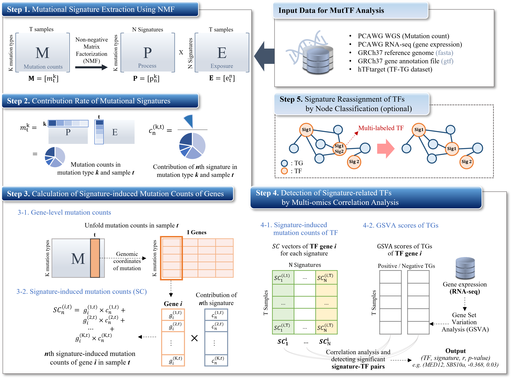

# Mutational Signature Analysis tool

MutTF is a multi-omics analysis framework that combines gene expression data with mutational signatures based on non-negative matrix decomposition and correlation analysis. MutTF can discover candidate transcription factors(TFs) that regulate target gene expression by mutational signatures.

<!--
나중에 여기에 논문 링크 넣기
-->



## Input Data

1. Variant files (.vcf)
2. Expression file (.tsv)


## Installation
1. Clone repository.
```
git clone https://github.com/BML-cbnu/MutTF
cd MutTF
```
2. Install the requirments.
```
pip install -r requirements.txt
```


## How to execute code

- [Step1) Mutation signature extraction](#Step1-Mutational-signature-extraction)  
- [Step2) Gene_count](#Step3-Gene_count)   
- [Step3) gsva](#Step4-gsva)   
- [Step4) MutTF](#Step5-MutTF)
- [Optional step](#Optional-Code)   

   
In the command line, please run the following:

### Step1. Mutational signature extraction

* input: <br>
  VCF file per sample
* variable: <br>
  [reference genome] => Enter the reference genome you want to analyze (e.g. GRCh37).
  [minimum] => Minimum number of signatures to extract
  [maximum] => Maximum number of signatures to extract
  [input directory] => directory where vcf files are located (e.g. input_data).
  [output directory] => directory where the output data should be stored.
  [threads] => number of threads to use in signature extraction
* Description: <br>
  Used **SigprofilerMatrixGenerator** to convert vcf files into count matrix, and used **sigProfilerExtractor** to extract signatures based on the count matrix generated.
  The optimal number of signature will be selected and used for further analysis. (Refer to './[output directory]/SBS96/SBS96_selection_plot.pdf' for the best number of signature)
  In this project, we used SBS96-based signatures (96 types of mutations in Single Base Substitution) in further analysis.
  Refer to https://cancer.sanger.ac.uk/signatures/tools/.
* output: <br>
  Signature extraction results
  The results are as shown in the tables below: <br>

  > Exposure Matrix (./[output directory]/SBS96/Suggested_Solution/SBS96_De-Novo_Solution/Activities/SBS96_De-Novo_Activities_refit.txt)

   | Samples | SBS96A | SBS96B | ... |
   | --- | --- | --- | --- |
   | Sample 1 | 22 | 40 |
   | Sample 2 | 35 | 13 |
   | ... | 16 | 32 |

  > Process Matrix ((./[output directory]/SBS96/Suggested_Solution/SBS96_De-Novo_Solution/Signatures/SBS96_De-Novo_Signatures.txt)

   | MutationType | SBS96A | SBS96B | ... |
   | --- | --- | --- | --- |
   | A[C>A]A | 0.024 | 0.014 |
   | A[C>A]C | 0.012 | 0.052 |
   | ... | 0.081 | 0.068 |

```bash
$ python Signature_extraction.py --ref_genome=[reference genome] --minimum=[minimum] --maximum=[maximum] --input_dir=[input data directory] --output_dir=[output data directory] --threads=[threads]
```

---

### Step2. Gene_count

* input: <br>
  VCF file per sample
* variable: <br>
  * [reference genome] => Enter the reference genome you want to analyze (e.g. GRCh37).
  * [input directory] => directory where vcf files are located (e.g. input_data).
  * [output directory] => directory where the output data should be stored.
  * [threads] => number of threads to use in multiprocessing
* Description: <br>
  Before we calculate the contribution of signatures, we need **gene-specific mutation counts** calculated using the annotation file of reference genome.
* output: <br>
  Gene count file per sample
  The results are as shown in the table below: <br>

   |  | Gene 1 | Gene 2 | ... |
   | --- | --- | --- | --- |
   | ACA>A | 2 | 0 |
   | ACC>A | 0 | 1 |
   | ... | 1 | 1 |

```bash
$ python Gene_count.py --ref_genome=[reference genome] --input_dir=[input directory] --output_dir=[output directory] --threads=[threads]
```

---

### Step3. GSVA

* input: <br>
  TF-TG geneset file, Expression file
* variable: <br>
  * [TF-TG geneset file] => TF-TG geneset file (e.g. ./hTFTarget/colon_TF-Target-information.txt)
  * [Expression file] => File name of gene expression file
  * [GSVA output file] => File name of GSVA output results
* Description: <br>
  Seperate TG into positively and negatively regulated groups based on correlation coefficient with corresponding TF expression value.
  Based on these groups, perform GSVA.
* output: <br>
  GSVA output file
  The results are as shown in the table below: <br>

   | Genesets | Sample 1 | Sample 2 | ... |
   | --- | --- | --- | --- |
   | TF1_0 | 0.4 | 0.3 |
   | TF1_1 | -0.9 | -0.1 |
   | ... | 0.1 | -0.6 |      

```bash
$ python GSVA.py -g [TF-TG geneset file] -e [Expression file] -o [GSVA output file]
```

---

### Step4. MutTF

* input: <br>
  Signature extraction results, Gene count matrix per sample, Seperated TF-TG geneset, GSVA results
* variable: <br>
  * [Signature extraction directory] => Directory of signature extraction results (output from **Signature_extraction.py**)
  * [Gene count directory] => Directory with gene-wise mutation count files (output from **Gene_count.py**)
  * [TF-TG geneset file] => TF-TG geneset file used in **GSVA.py** (e.g. ./hTFTarget/colon_TF-Target-information.txt)
  * [GSVA output file] => File name of GSVA results (output from **GSVA.py**)
  * [Correlation output directory] => Directory of correlation results between signature-induced mutation count and GSVA
* Description: <br>
  Calculate the signature's contribution (by sample).
  Analyze the correlation between gene-specific counts by signature and the GSVA score.
* output: <br>
  Correlation result matrix (gene id, signature id, correlation coefficient, p-value)
  The results are as shown in the table below: <br>

   | No. | Gene | sig | r | p |
   | --- | --- | --- | --- | --- |
   | 0 | Gene id | signature id | correlation coefficient | p-value |

```bash
$ python MutTF.py --ext_dir=[Signature extraction directory] --count_dir=[Gene count directory] --tf_file=[TF-TG geneset file] --gsva_folder=[GSVA output file] --corr_dir=[Correlation output directory]
```

---

## Optional Code

**Node_classification**

* input: gene expression data
* output: file as a result of node classification
* variable:
  * [pos or neg] => Enter the group for which you want to proceed node classification (pos or neg)
  * [tg divided into two groups] => As a result of correlation analysis based on gene expression, it means tf-tg data divided into positive and negative.
  * [the number of signatures] => The optimal number of signatures used for analysis
* You can proceed with node classification for multi-signature gene based on the result file from **Step 5**.
* The result file is saved in the directory named './output/Node_classi/'.
* The visualized graph figure is saved as './output/Node_classi/node_figure_XXX.png'

```bash
$ python Node_classification.py --pos_neg=[pos or neg] --tf_group_file=[tg divided into two groups] --sig_num=[the number of signatures]
```

---

**Denovo_cosine**

* input: matrix P
* output: image showing cosine similarity
* variable:
  * [reference genome] => Enter the reference genome you want to analyze (e.g. GRCh37).
  * [version] => Enter the version of cosmic signature you want to compare (e.g. 3.3.1)
* A heat map shows how the optimal signature extracted by De novo Signatures from **NMF.py** is similar to the cosmic signature.
* We referred from https://cancer.sanger.ac.uk/signatures/downloads/.
* Examples are as follows:
 

```bash
$ python Denovo_cosine.py --ref_genome=[reference genome] --version=[version]
```
