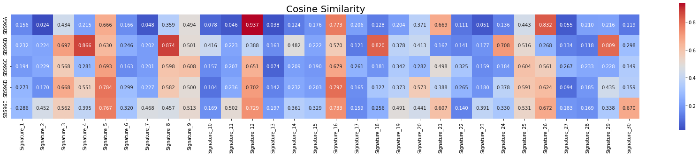

# Mutational Signature Analysis tool

This framework can discover candidate transcription factors(TFs) that regulate target gene expression by mutational signatures.

<!--
나중에 여기에 논문 링크 넣기
-->


## Input Data

인풋 데이터는 어떤 형식으로? -> vcf 형태


다 준비가 되었다면 분석이 필요한 mutation 데이터를 './input_data' 디렉토리에 넣기


>우리가 제공하는 샘플 데이터는 './sample' 폴더에 있음

## Installation
Clone repository.
```
git clone https://github.com/BML-cbnu/modelname
cd modelname
```

## How to execute code

- [Step1) Matrix Generator](#Step1-Matrix-Generator)   
- [Step2) NMF](#Step2-NMF)   
- [Step3) Gene_count](#Step3-Gene_count)   
- [Step4) gsva](#Step4-gsva)   
- [Step5) model_name](#Step5-model_name)
- [Optional step](#Optional-Code)   
   

In the command line, please run the following:

### Step1. Matrix Generator

* input: vcf file
* variable:
  * [reference genome] => 분석하려는 데이터의 reference genome을 입력하기(e.g. GRCh37)
* SigprofilerMatrixGenerator를 이용하여 input 파일을 count matrix(M) 형태로 변환해줌
* https://cancer.sanger.ac.uk/signatures/tools/ 에서 참고 가능

```bash
$ python MatGen.py --ref_genome=[reference genome]
```

---
### Step2. NMF

* input: count matrix(M)
* variable:
  * [reference genome] => 분석하려는 데이터의 reference genome을 입력하기(e.g. GRCh37)
  * [minimum] => 추출할 최소 시그니쳐 개수
  * [maximum] => 추출할 최대 시그니쳐 개수
* MatGen.py를 통해 만들어진 파일을 input data로 사용함
* 우리는 SBS96.all(Single Base Substitution의 96가지 mutation type)을 사용함
* 실행 후 결과 중 최적의ㅡ 시그니쳐를 선택하여 분석에 사용할 예정(최적의 시그니처는 './ext_data/SBS/SBS96_selection_plot.pdf'를 참고함)

```bash
$ python NMF.py --ref_genome=[reference genome] --min=[minimum] --max=[maximum]
```

---

### Step3. Gene_count

* input: vcf file, fasta, gtf file
* variable:
  * [reference genome] => 분석하려는 데이터의 reference genome을 입력하기(e.g. GRCh37)
* 우리는 기여도 계산을 하기 전, 특정 유전자 부분에서 발생한 gene count가 필요함
* reference genome의 annotation 파일을 활용하여 gene 별 count를 구하는 code
* 결과는 아래 table과 같은 형식으로 나옴

|  | Gene 1 | Gene 2 | ... |
| --- | --- | --- | --- |
| ACA>A | 2 | 0 |
| ACC>A | 0 | 1 |
| ... | 1 | 1 |

```bash
$ python Gene_count.py --ref_genome=[reference genome]
```

---

### Step4. gsva

* input: gene expression data
* variable:
  * [reference genome] => 분석하려는 데이터의 reference genome을 입력하기(e.g. GRCh37)
* 추후 정리 예정

```bash
$ python gsva.py --ref_genome=[reference genome]
```

---

### Step5. model_name

* 우리의 메인 분석 모델
* input: Gene count Matrix, GSVA score, TF-TG  data
* variable:
  * [gsva_result_folder] => gsva.py를 통해 나온 결과 파일이 있는 폴더를 입력
  * [tf_database_file] => 분석하고자 하는 TF-TG database 파일을 입력
* signature의 contribution(샘플 별)을 계산함
* sig-gene-mutation count와 GSVA score 사이의 correlation을 분석
* 최종 파일은 './output/Cor/'에 저장됨
* 결과 파일의 형태는 아래의 table과 같음

| No. | Gene | sig | r | p |
| --- | --- | --- | --- | --- |
| 0 | Gene id | signature id | correlation coefficient | p-value |

```bash
$ python gsva.py --gsva_folder=[gsva_result_folder] --tf_file=[tf_database_file]
```

---

## Optional Code

**Node_classification**

* input: gene expression data
* variable:
  * [pos or neg] => node classification을 진행하려는 그룹을 입력(pos or neg)
  * [tg divided into two groups] => gene expression을 기준으로 correlation 분석 결과, positive와 negative로 나뉜 tf-tg data
  * [the number of signatures] => 분석에 사용한 최적의 시그니처 개수
* 추후 정리 예정

```bash
$ python Node_classification.py --pos_neg=[pos or neg] --tf_group_file=[tg divided into two groups] --sig_num=[the number of signatures]
```

---

**Denovo_cosine**

* input: matrix P
* variable:
  * [reference genome] => 분석하려는 데이터의 reference genome을 입력하기(e.g. GRCh37)
  * [version] => 비교하고자 하는 cosmic signature의 version을 입력
* NMF.py를 통해 De novo 추출된 최적의 시그니쳐가 이미 연구된 cosmic signature와 얼마나 유사한지를 히트맵을 통해 보여줌
* 예시는 다음과 같음
 

```bash
$ python Denovo_cosine.py --ref_genome=[reference genome] --version=[version]
```
